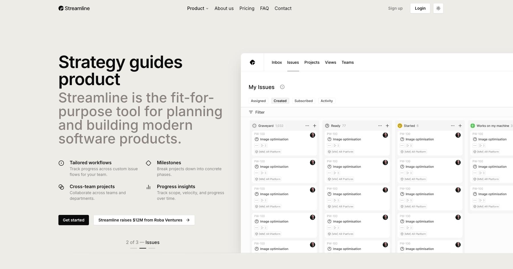

# Streamline NextJS Template

Streamline NextJS Template is a premium template built by https://www.shadcnblocks.com

- [Demo](https://streamline-nextjs-template.vercel.app/)
- [Documentation](https://docs.shadcnblocks.com/templates/getting-started)

## Screenshot



## Getting Started

```bash
npm install
```

```bash
npm run dev
```

Open [http://localhost:3000](http://localhost:3000) with your browser to see the result.

## Tech Stack

- Nextjs 15 / App Router
- Tailwind 4
- shadcn/ui

## Contributors

This project is maintained by the current development team.

## Deploy on Vercel

The easiest way to deploy your Next.js app is to use the [Vercel Platform](https://vercel.com)

```bash
npx vercel --prod
```